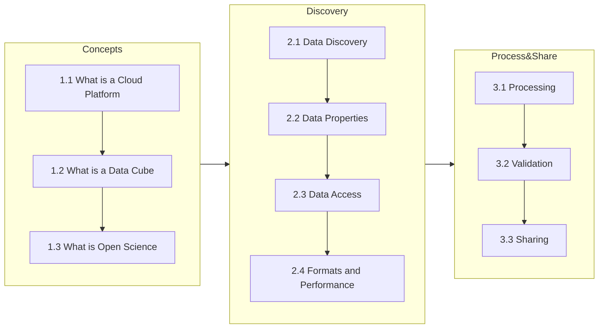

# Cubes and Clouds
This is the official content repository for the online course ['Cubes &amp; Clouds - Cloud Native Open Data Sciences for Earth Observation'](https://eo-college.org/courses/cubes-and-clouds) hosted on EO College.

## Description
The Massive Open Online Course **'Cubes &amp; Clouds - Cloud Native Open Data Sciences for Earth Observation'** teaches the concepts of data cubes, cloud platforms and open science in the context of earth observation. 

https://user-images.githubusercontent.com/51962348/234564489-98a56dd2-1359-4972-ad3c-0f0f2d4b450e.mp4

### Target Group
It targets Earth Science students and researchers who want to increase their technical capabilities onto the newest standards in EO computing, as well as Data Scientists who want to dive into the world of EO and apply their technical background to a new field.  Before starting, prerequisites are a general knowledge of EO and python programming.

### Content
The course explains the concepts of data cubes, EO cloud platforms and open science by applying them to a typical EO workflow from data discovery, data processing up to sharing the results in an open and FAIR (Findable, Accessible, Interoperable, Reusable) way. An engaging mixture of videos, animated content, lectures, hands-on exercises and quizzes transmits the content.

### Learning Objectives
After finishing the participant will understand the theoretical concepts of cloud native EO processing and have gained practical experience by conducting an end-to-end EO workflow. The participant will be capable of independently using cloud platforms to approach EO related research questions and be confident in how to share research by adhering to the concepts of open science.

## Sign-On Guide
TBD

## Contributing
We're happy to receive your contributions to lessons, exercises, bug reports etc.
- Check out the [CONTRIBUTING.md](CONTRIBUTING.md) contributing guide to learn how you can contribute! 
- The full list of all contributors is in the [CONTRIBUTORS.md](CONTRIBUTORS.md)

## Alternative Rendering of the Course
- LIAScript: Use the link to the .md files and copy them into [LIAscript](https://liascript.github.io/). It will give you an online lecture directly.
- Obsidian: Add obsidian file toplevel to create your void, or add the course to an existing one.
- Bookdown: You can render the course usin bookdown or similar to have a rendered version of the markdown files in the repo. Some work needed to do that.

## License
 Where not stated explicitly otherwise this work is licensed under a <a rel="license" href="http://creativecommons.org/licenses/by/4.0/">Creative Commons Attribution 4.0 International License</a>.

## Authors and Acknowledgement
### Reviewers
- 1.1 What is a Platform
  - TBD  
- 1.2 What is a Data Cube
  - TBD
- 1.3 What is Open Science (1.3.1, 1.3.2, 1.3.3)
  - Kristina Vrouwenvelder, American Geoscience Union
  - Shelley Stall, American Geoscience Union
- 2.1 Data Discovery
  - TBD
- 2.2 Data Properties
  - TBD 
- 2.3 Data Access and Basic Processing
  - TBD
- 2.4 Formats and Performance
  - TBD
- 3.1 Processing
  - TBD
- 3.2 Validation
  - Hannah Meyer, Universtiy of Münster
- 3.3 Sharing
  - Leandro Parente, Open Geo Hub Foundation

### Authors
             

## Funding
This project is funded by the European Space Agency through the program EXPRO+ with the contract number 4000138850/22/I-DT

## Project Status
The project is currently work in progress.

