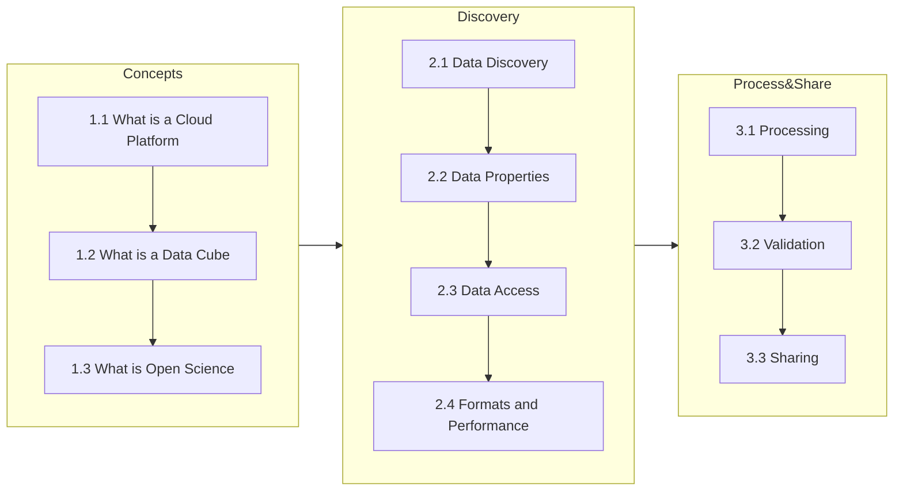

# Cubes and Clouds
This is the official content repository for the online course ['Cubes &amp; Clouds - Cloud Native Open Data Sciences for Earth Observation'](https://eo-college.org/courses/cubes-and-clouds) hosted on EO College.

## Description
The Massive Open Online Course **'Cubes &amp; Clouds - Cloud Native Open Data Sciences for Earth Observation'** teaches the concepts of data cubes, cloud platforms and open science in the context of earth observation. Here's the video on [youtube](https://www.youtube.com/watch?v=lCC0o6kNFt0) in case it doesn't play here.

https://user-images.githubusercontent.com/51962348/234564489-98a56dd2-1359-4972-ad3c-0f0f2d4b450e.mp4

### Target Group
It targets Earth Science students and researchers who want to increase their technical capabilities onto the newest standards in EO computing, as well as Data Scientists who want to dive into the world of EO and apply their technical background to a new field.  Before starting, prerequisites are a general knowledge of EO and python programming.

### Content
The course explains the concepts of data cubes, EO cloud platforms and open science by applying them to a typical EO workflow from data discovery, data processing up to sharing the results in an open and FAIR (Findable, Accessible, Interoperable, Reusable) way. An engaging mixture of videos, animated content, lectures, hands-on exercises and quizzes transmits the content.

### Learning Objectives
After finishing the participant will understand the theoretical concepts of cloud native EO processing and have gained practical experience by conducting an end-to-end EO workflow. The participant will be capable of independently using cloud platforms to approach EO related research questions and be confident in how to share research by adhering to the concepts of open science.

## Interactive Cubes and Clouds Map produced by the participants
Check out the interactive cubes and clouds map! It's produced by the participants of the course. Every participant adds their contribution to a community mapping project: mapping the snow cover of mountainous regions together!

[**Cubes and Clouds: Snow Cover STAC Collection**](https://esa.pages.eox.at/cubes-and-clouds-catalog/browser/#/?.language=en)

## Sign-On Guide
To follow the course completely, especially to execute the hands-on exercises on cloud platforms you will sign in to some free services.

- EOCollege: Access to the e-learning platform and the jupyterhub coding environment hosted by EOX.
- Copernicus Data Space Ecosystem: A cloud platform offering the data collections and computing resources for the exercises of the course.

You can find all the necessary information in the lecture [Introduction](https://github.com/EO-College/cubes-and-clouds/blob/main/lectures/0_introduction/0_introduction.md).

## Contributing
We're happy to receive your contributions to lessons, exercises, bug reports etc.
- Check out the [CONTRIBUTING.md](CONTRIBUTING.md) contributing guide to learn how you can contribute! 
- The full list of all contributors is in the [CONTRIBUTORS.md](CONTRIBUTORS.md)

## Availability of the course
- The course is openly available on **EOCollege**, a cloud learning platform for EO content. EOCollege is your one-stop-shop for this course. You will have an integrated experience of all the components: lectures, exercises, quizzes and get a certificate upon successful completion: https://eo-college.org/courses/cubes-and-clouds
- The course material is available on **zenodo**. Each lecture can be accessed individually: [Cubes and Clouds Zenodo Community](https://zenodo.org/communities/cubes_and_clouds?q=&l=list&p=1&s=10&sort=newest)
- Alternative Rendering of the Course
  - [Jupyter Book](https://eo-college.github.io/cubes-and-clouds/): web page of the course deployed using GitHub pages and Jupyter Books, updated at every merge of PR via GitHub actions. 
  - [LIAScript](https://liascript.github.io/): Use the link to the .md files and copy them into LIAscript. It will give you an online lecture directly.
  - [Obsidian](https://obsidian.md/): Obsidian is a knowledge management system. Add obsidian file toplevel to create your void, or add the course to an existing one.
  - [Bookdown](https://bookdown.org/): You can render the course using bookdown or similar to have a rendered version of the markdown files in the repo. Some work needed to do that.

## Authors and Acknowledgement
### Reviewers
- 1.1 What is a Platform: [Jeroen Dries, VITO](https://remotesensing.vito.be/team/jeroen-dries)
- 1.2 What is a Data Cube: [Pontus Lurcock, Brockmann Consult](https://www.brockmann-consult.de/about-us/); [David Montero, University of Leipzig](https://www.uni-leipzig.de/personenprofil/mitarbeiter/david-montero); [Gunnar Brandt, Brockann Consult](https://www.brockmann-consult.de/about-us/)
- 1.3 What is Open Science (1.3.1, 1.3.2, 1.3.3): [Kristina Vrouwenvelder, American Geoscience Union](https://www.rd-alliance.org/user/31394); [Shelley Stall, American Geoscience Union](https://www.rd-alliance.org/users/shelley-stall)
- 2.1 Data Discovery: [Matthias Mohr, Matthias Mohr Softwareentwicklung](https://mohr.ws/)
- 2.2 Data Properties: [Angelos Tzotsos, Open Source Geospatial Foundation](http://users.ntua.gr/tzotsos/); [Tom Kralidis, Meteorological Service of Canada](https://www.linkedin.com/in/tomkralidis/?originalSubdomain=ca)
- 2.3 Data Access and Basic Processing: [Edzer Pebesma, University of Münster](https://www.uni-muenster.de/Geoinformatics/institute/staff/index.php/119/edzer_pebesma)
- 2.4 Formats and Performance: [Aimee Barciauskas, Development Seed](https://developmentseed.org/team/aimee-barciauskas); [Ryan Avery, Development Seed](https://developmentseed.org/team/ryan-avery)
- 3.1 Processing: [Mattia Callegari, Eurac Research](https://www.eurac.edu/en/people/mattia-callegari)
- 3.2 Validation: [Hanna Meyer, Universtiy of Münster](https://www.uni-muenster.de/RemoteSensing/team/meyer/index.html)
- 3.3 Sharing: [Leandro Parente, Open Geo Hub Foundation](https://opengeohub.org/people/leandro-parente/)

### Authors
             

## Citation
Please refer to the whole course as described in the [CITATION.cff](https://github.com/EO-College/cubes-and-clouds/edit/main/CITATION.cff) file

> Zellner, P. J., Dolezalova, T., Claus, M., Eberle, J., Balogun, R. O., Meißl, S., Eckardt, R., Hodam, H., Jacob, A., & Anghelea, A. (2024). Cubes & Clouds - Cloud Native Open Data Sciences for Earth Observation (v1.0.0). Zenodo. https://doi.org/10.5281/zenodo.10869466

The individual chapters can be reused and explicitly cited as listed in the [Cubes and Clouds Zenodo Community](https://zenodo.org/communities/cubes_and_clouds?q=&l=list&p=1&s=10&sort=newest).

## License
 Where not stated explicitly otherwise this work is licensed under a <a rel="license" href="http://creativecommons.org/licenses/by/4.0/">Creative Commons Attribution 4.0 International License</a>.

## Funding
This project is funded by the European Space Agency through the program EXPRO+ with the contract number 4000138850/22/I-DT

## Project Status
The project is currently work in progress.

