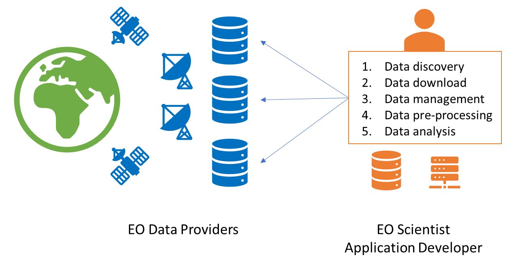
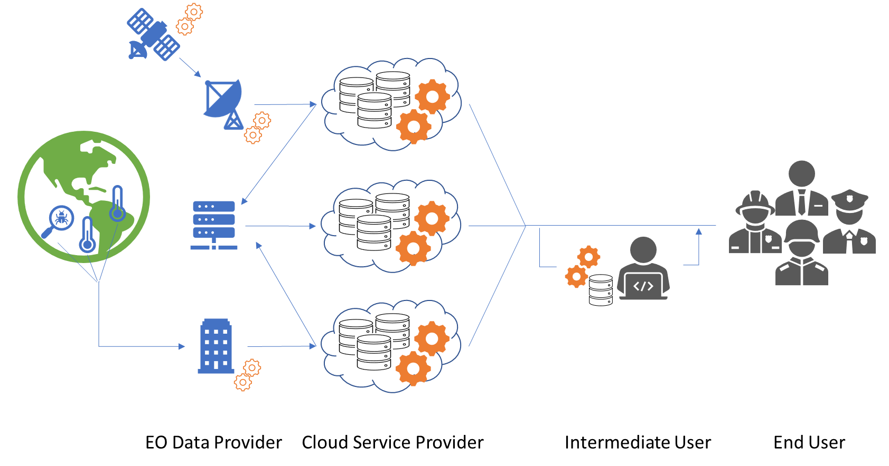
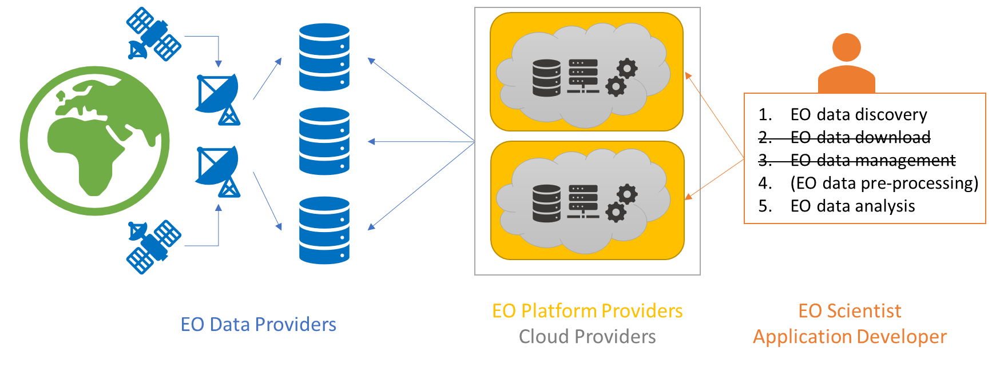
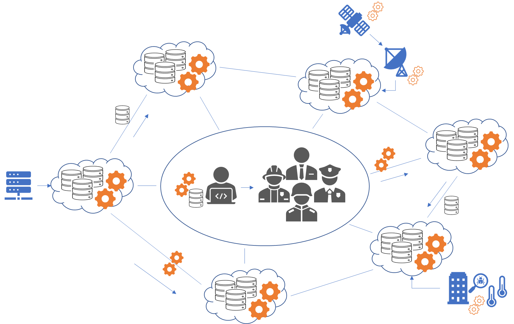

# Earth Observation cloud platforms

## Learning Objectives
- Understand why using a platform is useful
- Differentiate platform offerings
- Get to know the components and building blocks of a platform
- Learn why platform federation becomes important

## What is an EO platform?
Traditional approaches for the analysis of Earth Observation (EO) data typically involve several stages, including data discovery, data download, data pre-processing, and data analysis. Especially when working with multiple datasets, a complex process of data discovery, download, and integration is needed, where users need to navigate through different interfaces, adhere to varying access requirements, and manage the heterogeneity of data formats. This approach can be time-consuming and require significant effort to aggregate and harmonize datasets from different providers for comprehensive analysis (see Figure 1). 

Figure 1: Traditional data-centric approach, where large volumes of EO data are copied to and processed on local machines. Source: https://docs.ogc.org/per/21-023.html. 

The increasing availability of vast amounts of EO data from multiple satellites presents challenges in terms of the time required for data download and pre-processing on individual computers or infrastructures. To address this issue, cloud infrastructure and platforms have emerged as viable alternatives. These solutions combine data storage and compute resources, enabling users to conduct their data analysis in close proximity to the data itself. By leveraging cloud-based infrastructures, researchers and analysts can optimize their workflow by minimizing the time-consuming steps of data transfer and pre-processing, thereby allowing them to focus more efficiently on data analysis tasks.

**To Do: Use graphics and Numbers from this talk on the amount of Satellite Data increase: https://talks.osgeo.org/foss4g-2023/talk/C9CVBF/**

By utilizing cloud-based resources, users can harness the scalability and flexibility of these platforms to handle the extensive datasets generated by EO missions. Cloud-based EO platforms represent a paradigm shift in EO data analysis, offering a comprehensive ecosystem that seamlessly integrates storage, processing, analysis tools, collaboration, and visualization. These platforms empower users to overcome the challenges posed by large-scale EO data and accelerate scientific advancements in various fields, including environmental monitoring, climate studies, natural resource management, and disaster response.

### EO data volume and the limits of your computer
In the field of Earth Observation, satellite missions like Sentinel-2 provide vast amounts of data that play a crucial role in various applications, including environmental monitoring, land cover mapping, and climate analysis. Understanding the volume of data involved is critical for efficient data analysis. EO datasets can span terabytes and petabytes, making it impractical to store, manage, and process them entirely on a local computer.

The following interactive exercise assists in estimating the data volume associated with Sentinel-2 data. This calculator allows users to gain insights into the data volumes involved in specific regions and time ranges, further emphasizing the relevance of using EO platforms for scientific analyses.

#### Animated Content: Data Volume Calulator (java application)

## Types of platforms
Cloud-based EO infrastructures and platforms have emerged to meet the growing demand for efficient data processing, analysis, and visualization close to the data. We can distinguish between infrastructure providers and platform providers. 

### Infrastructure providers
EO-based infrastructure providers focus on offering the underlying infrastructure necessary for processing, storage, and dissemination of EO data. They provide the computing resources, storage capacity, and networking capabilities required to handle large-scale EO data processing and analysis. These providers often build and maintain data centers and server clusters, ensuring reliable and scalable infrastructure for EO applications.

In comparison to the traditional approach (Figure 1), this approach allow users to use computing resources close to the EO data (see Figure 2). However, there are no EO-specific services for data discovery, access, visualization, and analysis. 

Figure 2: Cloud-based data access and processing. Source: https://docs.ogc.org/per/21-023.html. 

**Examples of EO-based infrastructure providers**
1. Amazon Web Services (AWS): AWS offers a wide range of cloud services, including storage (Amazon S3) and computing (Amazon EC2), which can be leveraged for EO data processing and storage. 
2. Google Cloud Platform (GCP): GCP provides infrastructure services like Google Cloud Storage and Google Compute Engine, which can be utilized for EO data management and analysis. 
4. Microsoft Azure: Azure offers cloud-based services such as Azure Storage, Azure Virtual Machines, and Azure Machine Learning, enabling EO applications and workflows.
5. Open Telekom Cloud: Open Telekom Cloud is a cloud platform offered by Deutsche Telekom. It provides scalable infrastructure resources, including computing, storage, and networking capabilities, suitable for processing and storing large volumes of EO data. 
6. Cloudferro: Cloudferro is a cloud infrastructure provider specializing in geospatial data processing and analysis. They offer scalable and secure cloud resources optimized for EO applications. Cloudferro provides high-performance computing, storage, and networking services tailored for EO data processing workflows.

### Platform providers
Platform providers focus on delivering comprehensive EO platforms that combine infrastructure, tools, and services into a cohesive environment. These platforms typically offer a suite of integrated capabilities, including data storage, processing, analysis, visualization, and collaboration tools. They provide a user-friendly interface and simplify the EO data lifecycle, enabling users to access, process, and analyze EO data without managing the underlying infrastructure.

On top of providing the infrastructure which allows users to do the computations close to the EO data (Figure 2), making available a platform additionally enables the use of specific Application Programming Interfaces (APIs) for the discovery, access, visualization, exploitation, and analysis of EO data (see Figure 3). EO platforms are often made available on infrastructure providers to benefit from the EO data storage. 

Figure 3: User-centric approach with dedicated platforms for EO data management and analysis. Source: https://docs.ogc.org/per/21-023.html. 

**Examples of cloud-based EO platform providers**
1. Google Earth Engine is a platform specifically designed for EO data analysis. It provides access to a vast amount of satellite imagery and geospatial datasets, along with powerful processing capabilities and built-in algorithms. 
2. Sinergise Sentinel-Hub is a platform focused on accessing and processing satellite data. It provides APIs and easy-to-use tools for accessing, processing, and visualizing EO data.
3. Microsoft Planetary Computer is a platform that combines geospatial data and AI capabilities for Earth observation. It provides access to various global datasets, including satellite imagery, climate data, and environmental data. The platform aims to facilitate large-scale data analysis and support sustainable development and conservation efforts.
5. OpenEO Platform is a platform based on OpenEO, which aims to standardize and simplify the access and processing of EO data. It provides a unified API and common data model, enabling interoperability across multiple EO data providers and processing backends. The platform allows users to run EO workflows on various cloud-based infrastructure providers.

#### Video: Introduction to EO Platforms
* What is a EO platform and what are types of existing platforms?
	* From the traditional approach towards cloud-based infrastructures to EO platforms
	* What characterizes a platform? EO-specific services (e.g., metadata catalogue)
	* Refer to "What is a platform", "Types of platforms", and "Components of platforms"

### Summary
In summary, EO-based infrastructure providers primarily focus on providing the underlying infrastructure and resources, while platform providers offer integrated environments with a wide range of tools and services to support EO data processing, analysis, and visualization. These two types of providers complement each other in the EO ecosystem, enabling users to access and leverage EO data effectively.

## Components of platforms
Cloud-based EO platforms have transformed the way researchers and scientists analyze and utilize EO data. These platforms often follow a three-layered design comprising infrastructure, services, and exploitation interfaces. Leveraging the power of cloud computing, they provide a comprehensive ecosystem that seamlessly integrates storage, processing, analysis tools, collaboration, visualization, and data exploitation capabilities. 

By breaking down the components into infrastructure, services, and exploitation interfaces, these platforms offer an efficient and flexible environment for managing, processing, and deriving valuable insights from massive EO datasets. The following overview will explore each layer of the three-tiered design and provide examples to illustrate the functionalities and benefits of cloud-based EO platforms in real-world applications.

The following overview illustrate how the components of cloud-based EO platforms are implemented in real-world scenarios. They showcase the diverse range of tools, services, and interfaces available to store, process, analyze, collaborate, visualize, and exploit EO data effectively within the cloud environment.

#### Animated Content: Components of a platform (pop up)
Building Blocks of a cloud platform. Shows names of parts (and their role) upon mouse hovering.

### Infrastructure

1.  Data Storage: The infrastructure component may include distributed file systems like distributed parallel file systems (e.g., GPFS, Hadoop) or object storage services (e.g., Amazon S3, Google Cloud Storage) to securely store and manage EO datasets.
    
2.  Computing Resources: The infrastructure component can provide virtual machines (e.g., Amazon EC2, Google Compute Engine, OpenStack), container environments (e.g., Docker-Engine, Kubernetes Services) or batch-computing systems (e.g., High Performace Computing) for executing data processing and analysis tasks on EO datasets.

### Services

1. Data Cataloging and Metadata Management: Data available on the platform needs to be described with metadata to be findable by users. Often processing and analysis services, such as Open Data Cube or OpenEO, make use of the data catalogue to ease the use of EO data. These services enable users to annotate, search, and discover EO datasets based on various metadata parameters.
   
2. Data Access: This enables users to retrieve and access EO datasets. This may involve APIs, protocols, or data transfer mechanisms like Open Geospatial Consortium (OGC) Web Services or HTTP services for efficient and secure data access.

3. Data Processing and Analysis Tools: This service component may include widely used EO processing libraries like GDAL (Geospatial Data Abstraction Library), remote sensing software like SNAP (Sentinel Application Platform), or machine learning frameworks like TensorFlow or PyTorch for performing advanced analysis on EO data.

4. Collaboration and Sharing: Collaboration and sharing can be facilitated through platforms like GitHub, GitLab, or collaborative cloud-based platforms like Google Colaboratory or JupyterHub, where researchers can share code, algorithms, and workflows related to EO data analysis.

5. Data Visualization and Presentation: Visualization tools like QGIS or open-source libraries like Matplotlib, Plotly, or Leaflet can be utilized to create interactive visualizations, maps, and charts for effective communication and presentation of EO data analysis results.    

### Exploitation Interfaces

1.  User Interfaces: The exploitation interface component may include web-based interfaces like interactive web mapping tools (e.g., EO Browser from Sinergise) or NASA's Worldview, which provide interactive interfaces for users to explore and analyze EO data through a user-friendly interface.
    
2.  Application Programming Interfaces (APIs): APIs like Google Earth Engine API, Sentinel Hub API, or NASA's Earthdata API allow developers to programmatically access EO data and platform functionalities for building custom applications or integrating EO data analysis into their own workflows.

### Build a platform!
#### Animated Content: Components of a platform (drag and drop)
Building blocks of a Platform: Drag and drop them into a correct diagram, or drag the names into the diagram/image

## Federation of platforms
As the field of EO continues to advance, an increasing volume of satellite imagery, remote sensing data, and geospatial information becomes available. However, these resources are often dispersed across multiple platforms and databases, making it challenging for users to discover, access, and integrate the data effectively. 

### Why is federation necessary?
A federation becomes necessary to overcome these challenges and create a unified framework for accessing and utilizing EO data. By bringing together multiple cloud-based platforms, the federation provides a centralized entry point where users can easily discover and access a wide range of EO data sources. Instead of navigating through various platforms individually, users can leverage harmonized and standardized interfaces for all platforms to search for and access data seamlessly, saving time and effort (see Figure 4).

Figure 4: Federations of cloud-based systems. Source: https://docs.ogc.org/per/21-023.html. 

A federation promotes interoperability among different platforms, ensuring that data from various sources can be integrated and analyzed efficiently. It establishes a common interface or set of protocols that enable data sharing and collaboration across platforms. Moreover, it enhances scalability and computational power by leveraging cloud infrastructure. Cloud-based platforms can handle large-scale data processing and deliver near real-time insights, which would be challenging for individual platforms to achieve on their own. By pooling resources and infrastructure, a federation enables users to access high-performance computing capabilities and process large datasets effectively.

In summary, a federation of cloud-based EO platforms is necessary to streamline access to EO data, promote interoperability, foster collaboration, and leverage cloud infrastructure. It addresses the challenges posed by the growing volume and complexity of EO data, empowering users to unlock the full potential of Earth observation for various applications and domains.

#### Video: Looking into the future: A federated ecosystem of EO platforms. 
* Looking into the future: A federated ecosystem of EO platforms. 
	* We need federation because of ever increasing data volumes distributed all over the world.
	* Example of OpenEO platform?

### Aspects of federations
A federation of cloud-based EO platforms can be achieved through several key steps and considerations. The following aspects are involved in establishing a successful federation:

1. Standardization and Interoperability: To enable seamless data exchange and integration, it is essential to establish common standards and protocols across participating platforms. This includes agreeing upon metadata structures and APIs. Standardization ensures that different platforms can communicate and share data effectively.
       
2. Data Catalog and Metadata: Creating a comprehensive data catalog is crucial for the federation. Each participating platform should contribute to the catalog by providing detailed metadata about the available data sources, including descriptions, acquisition parameters, spatial and temporal coverage, and other relevant information. This metadata enables users to search, discover, and evaluate the data sources within the federation.
    
3. Data Access: The federation should provide mechanisms for accessing data seamlessly from different platforms. This can be achieved through a unified API (see standardization) that abstracts the underlying platform-specific details and provides a consistent interface for data retrieval. The API should allow users to access and integrate data from multiple platforms efficiently.
    
4. Authentication and Authorization: Establishing a secure authentication and authorization mechanism is crucial to ensure that only authorized users can access data and services within the federation. This involves implementing single sign-on (SSO) mechanisms, identity providers, and access control policies. Robust security measures are essential to protect sensitive data and maintain trust within the federation.
    
5. Collaboration and Governance: The federation should establish a governance framework to manage collaboration and decision-making among the participating platforms. This includes defining policies for data sharing, data usage, intellectual property rights, and code of conduct. Clear governance guidelines help maintain transparency, fairness, and accountability within the federation.    

By considering these aspects and implementing the necessary technical and organizational measures, the federation of EO platforms can be realized. It enables a unified ecosystem where users can access and leverage the collective resources, data sources, and analysis capabilities provided by multiple platforms, facilitating collaboration and unlocking the full potential of Earth observation for various applications.

### Example federation (todo)
TODO: OpenEO

## Exam (todo)
TODO

## Further reading
- Earth Observation Cloud Platform Concept Development Study Report: https://docs.ogc.org/per/21-023.html
- Big Earth data: disruptive changes in Earth observation data management and analysis? https://www.tandfonline.com/doi/full/10.1080/17538947.2019.1585976
- Enabling the Big Earth Observation Data via Cloud Computing and DGGS: Opportunities and Challenges: https://www.mdpi.com/2072-4292/12/1/62
- An Overview of Platforms for Big Earth Observation Data Management and Analysis: https://www.mdpi.com/2072-4292/12/8/1253
- The openEO API–Harmonising the Use of Earth Observation Cloud Services Using Virtual Data Cube Functionalities: https://www.mdpi.com/2072-4292/13/6/1125
