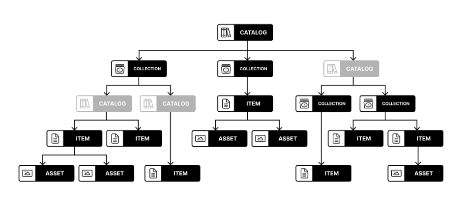
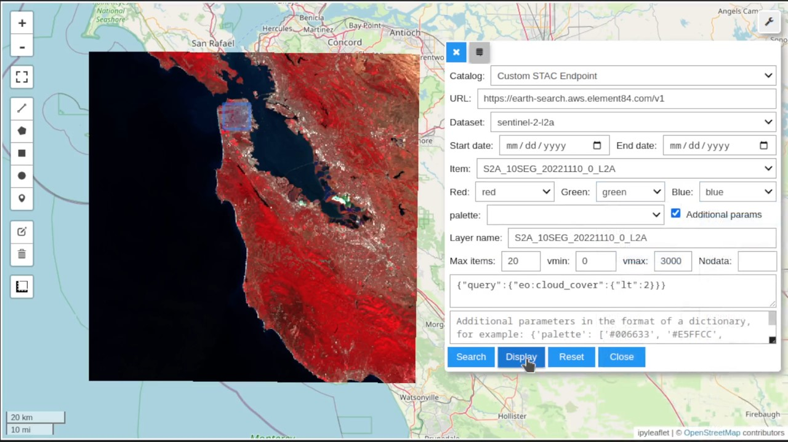

# Data Discovery

## Learning Objectives

- Find out what Data Sources we have
- Get to know where to get data
- Discover data catalogues
- Learn what STAC is

## What kind of data is available

#### Video: What kind of data can you find? And how?

[](https://youtu.be/NafY3AIw6f0) <br>
> Video content in collaboration with [Angelos Tzotsos](https://www.linkedin.com/in/tzotsos/?originalSubdomain=gr) (President OSGeo) and [Tom Kralidis](https://www.linkedin.com/in/tomkralidis/?originalSubdomain=ca) (Meteorological Service of Canada).

## Geospatial Data

Knowledge of various geospatial data types is essential for understanding, representing, and analyzing acquired data from various domains. Data carry not only spatial information but also measured values, derived data, or other targeted information. Based on their properties, they can be used for different purposes.

There are several common geospatial data types, each serving a specific purpose and having distinct characteristics.


### Raster data

Raster data are represented as pixels and grid cells where every pixel has a value associated with it. Data stored in raster format can be discrete (representing distinct categories, eg. land cover types) or continuous (for example temperature or elevation).

Examples of raster data sources:

- **Satellite data**  - Satellite imagery data are a common example of raster data. There are many types of data acquired by satellites and their processing. The temporal aspect of images is very important for continuous analysis. 
- **Aerial/drone orthophoto** - Digital imagery obtained by aircrafts (e.g. drones) is usually high-resolution raster data usable for detailed analysis.
- **DEM** - Digital Elevation Models are representing the surface of (usually) Earth and are essential for computations on a surface level.
  
### Vector data

Vector data are a fundamental type of geospatial data. Vector data represents spatial features using 3 basic classes -  points, lines, and polygons and the attributes associated with them. With vector data, it is possible to capture and analyze complex spatial patterns and attributes with great accuracy, providing valuable insights into spatial phenomena and supporting decision-making processes. Vector data are commonly used in addition to raster data to highlight or accompany trends and results.

Examples of vector data sources we will use in this course:

- **Land/sea mask** - A land/sea mask is usually a layer that identifies and delineates the land areas on a map or satellite image. It essentially acts as a filter or overlay that separates land from non-land areas, such as oceans, lakes, and other bodies of water. The land mask is typically represented as a binary or categorical, where land areas are assigned a specific value or classification while non-land areas are assigned another value.

- **Surface classification mask** - Surface mask acts as a classifier for different surface types and assigns each of them a distinct categorical value. Common types can be water, vegetation, or build-up areas

- **Cloud mask** - Cloud mask refers to the task of cloud detection in optical satellite data, where the common task is to detect (and remove) clouds to obtain better quality data.

### In-situ data

In-situ data are data collected directly at the place of interest and are connected to a special location. There are many reasons why these data are important and one of them is an enhancement of data collected by other means eg. weather measurements from satellites enhanced with local air quality measurements. There are many examples of what can be measured:

- **Temperature measurement**  
- **Soil quality measurement**

### Datacubes

Datacube refers to a multidimensional representation of data that incorporates spatial and temporal dimensions. It is a concept used to organize and analyze large volumes of geospatial information in a structured and efficient manner. Datacubes are combining the data types discussed above into one data structure. More about datacubes is in [Lesson 1.2](../1.2/datacubes.md)


# EO Catalog protocols

For Earth observation data discovery, it is essential to know about various used catalog protocols that define standardized methods and formats for organizing, describing, and accessing Earth observation data catalogs. 

Some commonly used protocols shared between diffent platforms include **OpenSearch**, **OGC CSW**, **OGC API - Records**, **STAC**, **OData** and more.

## OpenSearch

The OpenSearch specification was launched in 2005 by A9.com, an Amazon subsidiary, as a means for sharing search queries and search results in a standardized format.
The specification was intended to allow syndication of search results that could then be aggregated by one large index.
OpenSearch provides a simple to use description of the search interface, which is called an OpenSearch Description document (OSDD).
A client (e.g., a browser) can use this description to check which response formats are supported and how a query/filter can be formulated.
The OpenSearch based REST services are usually offered by existing EO data platforms for compatibility reasons as the protocol itself is stable and not extended anymore.
The data models of most catalogs build on top of XML or GeoJSON and allow filtering on a set of simple but not standardized properties. The protocol supports both textual and geospatial search and filtering capabilities, making it suitable for a wide range of applications, including web search engines and geospatial data catalogs.

## OGC CSW

Catalogue Service for the Web (CSW) standardized by Open Geospatial Consortium (OGC), offers a framework for publishing, discovering, and accessing metadata records, allowing users to effectively search and retrieve geospatial data and related information. The catalogue is made up of records that describe geospatial data, linked geospatial services and related resources.
CSW enables metadata query using metadata core (mandatory) elements.
Catalogue services support the use of one of several identified query languages to find and return results using well-known content models (metadata schemas) and encodings.

## OGC API - Features

OGC API - Features is a modern and flexible geospatial data access protocol developed by the OGC. It provides a standardized and RESTful approach for querying, retrieving, and manipulating geospatial feature data over the web. By leveraging the power of web technologies such as HTTP, JSON, and GeoJSON, OGC API - Features simplifies the process of accessing and working with geospatial data. It allows users to retrieve specific features based on spatial and attribute filters, perform spatial and attribute queries, and even modify feature data through standard HTTP methods.

## OGC API - Records

OGC API - Records is a multi-part draft specification (built on top of OGC API - Features) that offers the capability to create, modify, and query metadata on the Web. The draft specification enables the discovery of geospatial resources by standardizing the way collections of descriptive information about the resources (metadata) are exposed. The specification also enables the discovery and sharing of related resources that may be referenced from geospatial resources or their metadata by standardizing the way all kinds of records are exposed and managed.

## STAC

STAC stands for SpatioTemporal Asset Catalog. It is a community specification that provides a common way for describing and cataloging assets that have a connection to space and time, usually but not necessarily on the Earth. The STAC specification focuses on organizing and sharing geospatial data in a way that is accessible, interoperable, and scalable. The STAC Specification consists of 4 semi-independent specifications (Catalog, Collection, Item and API) which can work independently or be used together. All of them can be and are enriched by a variety of extensions.
It is a relatively new specification but increasingly integrated by various data providers and seen as future of EO Data cataloguing and discovery. The data model in the dataspace is still evolving to comply fully with all standardized properties. Because of that, more attention is provided to STAC than other catalogue protocols in this tutorial.


### The components of STAC
The STAC specification is divided into three main parts:
- STAC specification for static catalogs, which consists of three parts:
  - STAC Items
  - STAC Catalogs
  - STAC Collections
- STAC API specification for dynamic catalogs.
- STAC extensions (both for static STAC and the STAC API)

All these components are fairly independant, but all components work together and use links to express the relationship between them so that eventually clients can traverse through them. The links to the actual spatio-temporal data files that the STAC metadata describes are handled specifically and are called STAC Assets. Assets can be made available in Items and Collections.


 <br>
>Image by Matthias Mohr from https://mohr.ws/foss4g/

#### STAC Item

A STAC Item is the foundational building block of STAC. It is a GeoJSON feature supplemented with additional metadata that enables clients to traverse through catalogs. Since an item is a GeoJSON, it can be easily read by any modern GIS or geospatial library. One item can describe one or more SpatioTemporal Asset(s). For example, a common practice of using STAC for imagery is that each band in a scene is its own STAC Asset and there is one STAC Item to represent all the bands in a single scene.

The STAC Item JSON specification uses standard GeoJSON fields as well as a few additional informational fields to describe the asset(s) more thoroughly.

STAC Item (and other components) have some required fields which must be always filled with information. In the example below, required fields like type, stac_version or id are filled. Properties are also required fields, but here also extended by many STAC extensions, in the format of extension_name:field_name: value. STAC extensions are also listed in the stac_extensions field. Complete STAC Item spec can be found on [GitHub](https://github.com/radiantearth/stac-spec/blob/master/item-spec/item-spec.md).

<details>
  <summary>Example of a Sentinel 2 L2A STAC Item with one band asset.</summary>

```json
{
   "type":"Feature",
   "stac_version":"1.0.0",
   "id":"S2B_43SCR_20231123_0_L2A",
   "properties":{
      "created":"2023-11-23T08:25:34.597Z",
      "platform":"sentinel-2b",
      "constellation":"sentinel-2",
      "instruments":[
         "msi"
      ],
      "eo:cloud_cover":0.414053,
      "proj:epsg":32643,
      "mgrs:utm_zone":43,
      "mgrs:latitude_band":"S",
      "mgrs:grid_square":"CR",
      "grid:code":"MGRS-43SCR",
      "view:sun_azimuth":161.976971280106,
      "view:sun_elevation":35.5947611411469,
      "s2:degraded_msi_data_percentage":0,
      "s2:nodata_pixel_percentage":77.337396,
      "s2:saturated_defective_pixel_percentage":0,
      "s2:dark_features_percentage":0,
      "s2:cloud_shadow_percentage":0.002591,
      "s2:vegetation_percentage":0.010072,
      "s2:not_vegetated_percentage":98.205149,
      "s2:water_percentage":0.9589,
      "s2:unclassified_percentage":0.38101,
      "s2:medium_proba_clouds_percentage":0.410817,
      "s2:high_proba_clouds_percentage":0.003235,
      "s2:thin_cirrus_percentage":0,
      "s2:snow_ice_percentage":0.028226,
      "s2:product_type":"S2MSI2A",
      "s2:processing_baseline":"05.09",
      "s2:product_uri":"S2B_MSIL2A_20231123T054139_N0509_R005_T43SCR_20231123T070647.SAFE",
      "s2:generation_time":"2023-11-23T07:06:47.000000Z",
      "s2:datatake_id":"GS2B_20231123T054139_035066_N05.09",
      "s2:datatake_type":"INS-NOBS",
      "s2:datastrip_id":"S2B_OPER_MSI_L2A_DS_2BPS_20231123T070647_S20231123T054133_N05.09",
      "s2:granule_id":"S2B_OPER_MSI_L2A_TL_2BPS_20231123T070647_A035066_T43SCR_N05.09",
      "s2:reflectance_conversion_factor":1.02412472897181,
      "datetime":"2023-11-23T05:50:10.118000Z",
      "s2:sequence":"0",
      "earthsearch:s3_path":"s3://sentinel-cogs/sentinel-s2-l2a-cogs/43/S/CR/2023/11/S2B_43SCR_20231123_0_L2A",
      "earthsearch:payload_id":"roda-sentinel2/workflow-sentinel2-to-stac/ee5536069c6dd3a13ae2dbd530beafeb",
      "earthsearch:boa_offset_applied":true,
      "processing:software":{
         "sentinel2-to-stac":"0.1.1"
      },
      "updated":"2023-11-23T08:25:34.597Z"
   },
   "geometry":{
      "type":"Polygon",
      "coordinates":[
         [
            [
               73.91301155493866,
               32.53264844646899
            ],
            [
               73.65302362425264,
               31.539681428386213
            ],
            [
               74.04974127686076,
               31.543245006457585
            ],
            [
               74.03945448697993,
               32.53367782512506
            ],
            [
               73.91301155493866,
               32.53264844646899
            ]
         ]
      ]
   },
   "links":[
      {
         "rel":"self",
         "type":"application/geo+json",
         "href":"https://earth-search.aws.element84.com/v1/collections/sentinel-2-l2a/items/S2B_43SCR_20231123_0_L2A"
      },
      {
         "rel":"canonical",
         "href":"s3://sentinel-cogs/sentinel-s2-l2a-cogs/43/S/CR/2023/11/S2B_43SCR_20231123_0_L2A/S2B_43SCR_20231123_0_L2A.json",
         "type":"application/json"
      },
      {
         "rel":"license",
         "href":"https://sentinel.esa.int/documents/247904/690755/Sentinel_Data_Legal_Notice"
      },
      {
         "rel":"derived_from",
         "href":"https://earth-search.aws.element84.com/v1/collections/sentinel-2-l1c/items/S2B_43SCR_20231123_0_L1C",
         "type":"application/geo+json"
      },
      {
         "rel":"parent",
         "type":"application/json",
         "href":"https://earth-search.aws.element84.com/v1/collections/sentinel-2-l2a"
      },
      {
         "rel":"collection",
         "type":"application/json",
         "href":"https://earth-search.aws.element84.com/v1/collections/sentinel-2-l2a"
      },
      {
         "rel":"root",
         "type":"application/json",
         "href":"https://earth-search.aws.element84.com/v1"
      },
      {
         "rel":"thumbnail",
         "href":"https://earth-search.aws.element84.com/v1/collections/sentinel-2-l2a/items/S2B_43SCR_20231123_0_L2A/thumbnail"
      }
   ],
   "assets":{
      "blue":{
         "href":"https://sentinel-cogs.s3.us-west-2.amazonaws.com/sentinel-s2-l2a-cogs/43/S/CR/2023/11/S2B_43SCR_20231123_0_L2A/B02.tif",
         "type":"image/tiff; application=geotiff; profile=cloud-optimized",
         "title":"Blue (band 2) - 10m",
         "eo:bands":[
            {
               "name":"blue",
               "common_name":"blue",
               "description":"Blue (band 2)",
               "center_wavelength":0.49,
               "full_width_half_max":0.098
            }
         ],
         "gsd":10,
         "proj:shape":[
            10980,
            10980
         ],
         "proj:transform":[
            10,
            0,
            300000,
            0,
            -10,
            3600000
         ],
         "raster:bands":[
            {
               "nodata":0,
               "data_type":"uint16",
               "bits_per_sample":15,
               "spatial_resolution":10,
               "scale":0.0001,
               "offset":-0.1
            }
         ],
         "roles":[
            "data",
            "reflectance"
         ]
      },
      "thumbnail":{
         "href":"https://sentinel-cogs.s3.us-west-2.amazonaws.com/sentinel-s2-l2a-cogs/43/S/CR/2023/11/S2B_43SCR_20231123_0_L2A/thumbnail.jpg",
         "type":"image/jpeg",
         "title":"Thumbnail image",
         "roles":[
            "thumbnail"
         ]
      }
   },
   "bbox":[
      73.65302362425264,
      31.539681428386213,
      74.04974127686076,
      32.53367782512506
   ],
   "stac_extensions":[
      "https://stac-extensions.github.io/view/v1.0.0/schema.json",
      "https://stac-extensions.github.io/grid/v1.0.0/schema.json",
      "https://stac-extensions.github.io/mgrs/v1.0.0/schema.json",
      "https://stac-extensions.github.io/raster/v1.1.0/schema.json",
      "https://stac-extensions.github.io/processing/v1.1.0/schema.json",
      "https://stac-extensions.github.io/eo/v1.1.0/schema.json",
      "https://stac-extensions.github.io/projection/v1.1.0/schema.json"
   ],
   "collection":"sentinel-2-l2a"
}
```
</details>

Source URL: [https://earth-search.aws.element84.com/v1/collections/sentinel-2-l2a/items/S2B_43SCR_20231123_0_L2A](https://earth-search.aws.element84.com/v1/collections/sentinel-2-l2a/items/S2B_43SCR_20231123_0_L2A)

#### STAC Catalog

A STAC Catalog is an entity that logically groups other Catalogs, Collections, and Items. A Catalog contains links to these other entities and can include additional metadata to describe the entities contained therein. A catalog is usually the starting point for navigating a STAC. More specifically, a `catalog.json` file contains links to some combination of other STAC Catalogs, Collections, and/or Items. We can think of it like a directory on a computer although it doesn't necessarily need to mirror the local directory tree.

There are no restrictions on the way STAC Catalogs are organized. Therefore, the combination of STAC components within a STAC Catalog is quite variable and flexible. Many implementations use a set of 'sub-catalog(s)' that group the items in some sensible way, e.g. by years as a first level and months as a second level. It can be easily extended, for example, to include additional metadata to further describe its holdings, as the STAC Collection does.

#### STAC Colection

A STAC Collection is similar to a STAC Catalog, but includes and partially requires additional metadata about a set of items that exist as part of the collection. It adds additional fields to enable the description of information like the spatial and temporal extent of the data, the license, keywords, providers, etc. Therefore, it can easily be extended with additional collection-level metadata that is common across all children. For example, it could summarize that all Items underneath hold data in either 10m or 30m spatial resolution.


<details>
  <summary>Example of a Sentinel 2 L2A STAC Collection.</summary>

```json
{
   "type":"Collection",
   "id":"sentinel-2-l2a",
   "stac_version":"1.0.0",
   "description":"Global Sentinel-2 data from the Multispectral Instrument (MSI) onboard Sentinel-2",
   "links":[
      {
         "rel":"self",
         "type":"application/json",
         "href":"https://earth-search.aws.element84.com/v1/collections/sentinel-2-l2a"
      },
      {
         "rel":"cite-as",
         "href":"https://doi.org/10.5270/S2_-742ikth",
         "title":"Copernicus Sentinel-2 MSI Level-2A (L2A) Bottom-of-Atmosphere Radiance"
      },
      {
         "rel":"license",
         "href":"https://sentinel.esa.int/documents/247904/690755/Sentinel_Data_Legal_Notice",
         "title":"proprietary"
      },
      {
         "rel":"parent",
         "type":"application/json",
         "href":"https://earth-search.aws.element84.com/v1"
      },
      {
         "rel":"root",
         "type":"application/json",
         "href":"https://earth-search.aws.element84.com/v1"
      },
      {
         "rel":"items",
         "type":"application/geo+json",
         "href":"https://earth-search.aws.element84.com/v1/collections/sentinel-2-l2a/items"
      },
      {
         "rel":"http://www.opengis.net/def/rel/ogc/1.0/queryables",
         "type":"application/schema+json",
         "href":"https://earth-search.aws.element84.com/v1/collections/sentinel-2-l2a/queryables"
      },
      {
         "rel":"aggregate",
         "type":"application/json",
         "href":"https://earth-search.aws.element84.com/v1/collections/sentinel-2-l2a/aggregate",
         "method":"GET"
      },
      {
         "rel":"aggregations",
         "type":"application/json",
         "href":"https://earth-search.aws.element84.com/v1/collections/sentinel-2-l2a/aggregations"
      }
   ],
   "stac_extensions":[
      "https://stac-extensions.github.io/item-assets/v1.0.0/schema.json",
      "https://stac-extensions.github.io/view/v1.0.0/schema.json",
      "https://stac-extensions.github.io/scientific/v1.0.0/schema.json",
      "https://stac-extensions.github.io/raster/v1.1.0/schema.json",
      "https://stac-extensions.github.io/eo/v1.0.0/schema.json"
   ],
   "title":"Sentinel-2 Level 2A",
   "extent":{
      "spatial":{
         "bbox":[
            [
               -180,
               -90,
               180,
               90
            ]
         ]
      },
      "temporal":{
         "interval":[
            [
               "2015-06-27T10:25:31.456000Z",
               null
            ]
         ]
      }
   },
   "license":"proprietary",
   "keywords":[
      "sentinel",
      "earth observation",
      "esa"
   ],
   "providers":[
      {
         "name":"ESA",
         "roles":[
            "producer"
         ],
         "url":"https://earth.esa.int/web/guest/home"
      },
      {
         "name":"Sinergise",
         "roles":[
            "processor"
         ],
         "url":"https://registry.opendata.aws/sentinel-2/"
      },
      {
         "name":"AWS",
         "roles":[
            "host"
         ],
         "url":"http://sentinel-pds.s3-website.eu-central-1.amazonaws.com/"
      },
      {
         "name":"Element 84",
         "roles":[
            "processor"
         ],
         "url":"https://element84.com"
      }
   ],
   "summaries":{
      "platform":[
         "sentinel-2a",
         "sentinel-2b"
      ],
      "constellation":[
         "sentinel-2"
      ],
      "instruments":[
         "msi"
      ],
      "gsd":[
         10,
         20,
         60
      ],
      "view:off_nadir":[
         0
      ],
      "sci:doi":[
         "10.5270/s2_-znk9xsj"
      ],
      "eo:bands":[
         {
            "name":"blue",
            "common_name":"blue",
            "description":"Blue (band 2)",
            "center_wavelength":0.49,
            "full_width_half_max":0.098
         }
      ]
   }
}
```
</details>

Source URL: [https://earth-search.aws.element84.com/v1/collections/sentinel-2-l2a](https://earth-search.aws.element84.com/v1/collections/sentinel-2-l2a)

#### STAC API

STAC API is a dynamic version of a static SpatioTemporal Asset Catalog and provides a RESTful endpoint that enables the search of STAC Items and STAC Collections. STAC Catalogs don't play a big role in APIs as they are mostly used as an entity for grouping larger static catalogs into smaller chunks, which is usually not needed in the context of a dynamic API.

If the API implements the Filter or Query extension, additionally the user is allowed to search for specific content based on a set of available metadata fields. Additional extensions may support more interactive elements such as aggregations, or managing the metadata (updating it, creating new entities, or deleting some) through transactions.

A part of the STAC API is built on top of [OGC API - Features](#ogc-api---features).


#### STAC Extension

Extensions to STAC are split into two parts: STAC extensions and STAC API extensions. They are both an important addition to the STAC specifications and can provide either additions to the data model (i.e. additional JSON properties such as `eo:cloud_cover`) or behavioural changes (e.g. additional types of links or a sorting functionality). Most tend to be about describing a particular domain or type of data.

To find out which extensions do the STAC API, STAC Catalog, Collection or Item object implement, you can explore [list of STAC extensions](stac-extensions.github.io/#list-of-stac-extensions) or [list of STAC API extensions](stac-api-extensions.github.io/#list-of-stac-api-extensions).


## ODAta

OData (Open Data Protocol) specifies a variety of best practices for creating and using REST APIs that can be handled by a large set of client tools like common web browsers, download-managers. The OData protocol can be used for building URI for performing search queries and product downloads for example on the Copernicus Dataspace.


### References and further readings

- [OpenSearch specification](https://github.com/dewitt/opensearch) 
- [OGC OpenSearch Geo, Time and EO extensions](https://www.ogc.org/standard/opensearch)
- [OpenSearch API access examples](https://documentation.dataspace.copernicus.eu/APIs/OpenSearch.html)
- [OGC CSW specification](https://www.ogc.org/standard/cat/)
- [OGC API - Features](https://www.ogc.org/standard/ogcapi-features/)
- [OGC API - Records (Draft)](https://docs.ogc.org/DRAFTS/20-004.html)
- More to read about [STAC specification](https://stacspec.org/en)
- [STAC Tutorials](https://stacspec.org/en/tutorials/)
- [OData on Copernicus Dataspace](https://documentation.dataspace.copernicus.eu/APIs/OData.html)

## Where to search for data

Earth observation data access is not limited to a single platform or a single entry point. What follows is a non-exhaustive list of some well-known Earth observation data catalogues usually based around the original agency providing the data:

- [EarthData Search](https://search.earthdata.nasa.gov/search): A comprehensive data discovery and access tool provided by NASA's Earth Observing System Data and Information System (EOSDIS). Contains wide range of NASA's Earth science data.
- [Copernicus Data Space](https://dataspace.copernicus.eu/explore-data/data-collections): Currently in development platform aiming to provide immediate access to large amounts of open and free Earth observation data and scalable interfaces including both new and historical Sentinel images, commercial datasets, as well as Copernicus Contributing Missions.
- [USGS Earth Explorer](https://earthexplorer.usgs.gov/): EarthExplorer (EE) provides online search, browse display, metadata export, and data download for earth science data from the archives of the U.S. Geological Survey (USGS). Usually of largest demand are data from the Landsat missions.
- [Open Science Catalog](https://opensciencedata.esa.int/): A catalog of publicly available geoscience products, datasets and resources developed in the frame of scientific research Projects funded by ESA EO. Queriable by themes, projects, variables and products.
- [NCEI Catalog](https://www.ncei.noaa.gov/access): NOAA's National Centers for Environmental Information (NCEI) provides access to various environmental data, including satellite imagery, climate data, and other geospatial datasets. In particular it is composed of oceanic, atmospheric, and geophysical data.
- [STAC Index](https://stacindex.org/catalogs): A list of publicly available STAC APIs and Static Catalogs.


<iframe width="1000" height="600" src="https://openeo.cloud/data-collections/" title="openEO platform collections" frameborder="0" allowfullscreen></iframe>

## How to search for data

Large EO data portals usually allow two main different ways of access based on the technical proficiency of the target user group. User can either use graphical user interface of selected portal or use one the available APIs for search. Bellow are examples of way how to search for your data.

### Web Browser Catalogue client

Many large portals provide a easy-to-use search and filtering GUI, which under the hood uses one of the provided catalog APIs. This allows less experienced users to perform queries usually for smaller subset of data with the help of an attached Web map client to orient themselves easily.


### API access

For batch operations or script access to the catalogs, it is envisioned that direct approach of the API is performed instead. This removes the need for direct user interaction to the web platform and can be used from user provided scripts or other programs and CLI tools.

Fore more information about performing filtering or queries, see [Data Properties](../2.2_data_properties/2.2_properties.md).

### STAC Browser

In order to access and browse any online STAC catalog or API, a rich web client application STAC Browser can be used on [radiantearth.github.io/stac-browser](https://radiantearth.github.io/stac-browser). It does does allow a wide variety of filtering capabilities.

### STAC QGIS plugin

[QGIS STAC API Browser](https://stac-utils.github.io/qgis-stac-plugin/) provides a simple and user-friendly approach in searching and using STAC API resources in QGIS. It offers a comfortable way to filter and browse the STAC API items and ability to add the STAC API assets as map layers into the QGIS.

### QGIS MetaSearch Catalog Client

[MetaSearch](https://docs.qgis.org/3.28/en/docs/user_manual/plugins/core_plugins/plugins_metasearch.html) is a QGIS plugin to interact with metadata catalog services, supporting both the OGC API - Records and OGC Catalog Service for the Web (CSW) standards.

### OWSLib

[OWSLib](https://owslib.readthedocs.io/en/latest/) is a Python package for client programming with Open Geospatial Consortium (OGC) web service (hence OWS) interface standards, and their related content models. The OWSLib client offers support for OGC CSW, OGC API - Records and OpenSearch based catalog services.

### PySTAC client

The [STAC Python Client (pystac_client)](https://pystac-client.readthedocs.io/en/stable/) is a Python package for working with STAC Catalogs and APIs that conform to the STAC and STAC API specs in a seamless way. PySTAC Client builds upon PySTAC through higher-level functionality and ability to leverage STAC API search endpoints.

[](assets/stac_leafmap.mp4)

> Video produced by Qiusheng Wu (https://github.com/opengeos/leafmap/pull/347#issuecomment-1402560159)


### Further Reading
- [STAC tutorials](https://stacspec.org/en/tutorials/)
- [Echoes in space course](https://eo-college.org/courses/echoes-in-space/)


### References
- [STAC](https://stacspec.org/en)
- [OWSLib](https://owslib.readthedocs.io/en/latest/)
- [STAC Python Client (pystac_client)](https://pystac-client.readthedocs.io/en/stable/)
- [radiantearth.github.io/stac-browser](https://radiantearth.github.io/stac-browser)
- [OpenSearch specification](https://github.com/dewitt/opensearch)

## Quiz
Let's test your understanding of data types and where to find them. We will be working with the actual data shortly in the next chapters!

### STAC 
What does the STAC stand for:

    [( )] Spatio and Temporal Asset Certification
    [(x)] SpatioTemporal Asset Catalog
    [( )] SpatioTemporal Asset Colections

In which line are only mandatory properties of STAC item?
  
    [(x)] type, id, assets, properties
    [( )] id, assets, collection, stac_version
    [( )] type, id, stac_version, stac_extensions


### Data Catalogs and Access Protocols

In which of those data access API's you can use on Copernicus Dataspace

    [(x)] OData
    [( )] STAC API
    [(x)] OGC API - Features


Use an online catalog browser of Copernicus Dataspace to search for Sentinel 2 L2A products over the island of Sardinia between 1.9.2023 and 30.9.2023 with cloud coverage less than or equal to 20% and get the number of returned products. 

    [[59]]
