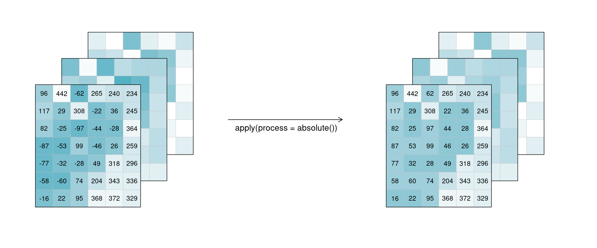

## Access EO Data from the Cloud

Using a cloud provider for accessing data, and in this specific scenario Earth Observation data, could improve your productivity a lot. To get the most out of it, we will provide you some important insights.

### Learning objectives
At the end of this lecture you should have learned what **lazy loading** is and why it's important when working with large data collections. ## TDDO: move this to 2.4

Moreover, you should have learned the usage and peculiarities of the main data operators commonly available on cloud providers like:
1. Filter
2. Apply
3. Reduce
4. Resample
4. Aggregate

Finally, you should be able to create a simple workflow represented by an openEO process graph.

## Processes on Datacubes

In the following part, the basic processes for manipulating datacubes are introduced.

### Filter

When filtering data (e.g. [`filter_spatial`](https://processes.openeo.org/#filter_spatial), [`filter_temporal`](https://processes.openeo.org/#filter_temporal), [`filter_bands`](https://processes.openeo.org/#filter_bands)), only the data that satisfies a condition is returned. For example, this condition could be a timestamp or interval, (a set of) coordinates, or specific bands. By applying filtering the datacube becomes smaller, according to the selected data.

::: tip Simplified
`filter([🌽, 🥔, 🐷], isVegetarian) => [🌽, 🥔]`
:::

In the image, the example datacube can be seen at the top with labeled dimensions. The filtering techniques are displayed separately below. On the left, the datacube is filtered temporally with the interval `["2020-10-15", "2020-10-27"]`. The result is a cube with only the rasters for the timestep that lies within that interval (`"2020-10-25"`) and unchanged bands and spatial dimensions. Likewise, the original cube is filtered for a specific band `["nir"]` in the middle and a specific spatial region `[Polygon(...)]` on the right.

### EXERCISE: 23_data_access_filter.ipynb

### Apply

The `apply*` functions (e.g. [`apply`](https://processes.openeo.org/#apply), [`apply_neighborhood`](https://processes.openeo.org/#apply_neighborhood), [`apply_dimension`](https://processes.openeo.org/#apply_dimension)) employ a process on the datacube that calculates new pixel values for each pixel, based on `n` other pixels. Please note that several programming languages use the name `map` instead of `apply`, but they describe the same type of function.

::: tip Simplified
`apply([🌽, 🥔, 🐷], cook) => [🍿, 🍟, 🍖]`
:::

For the case `n = 1` this is called a unary function and means that only the pixel itself is considered when calculating the new pixel value. A prominent example is the `absolute()` function, calculating the absolute value of the input pixel value. 

If `n` is larger than 1, the function is called n-ary. In practice, this means that the pixel neighbourhood is taken into account to calculate the new pixel value. Such neighbourhoods can be of spatial and/or temporal nature. A spatial function works on a kernel that weights the surrounding pixels (e.g. smoothing values with nearby observations), a temporal function works on a time series at a certain pixel location (e.g. smoothing values over time). Combinations of types to n-dimensional neighbourhoods are also possible.

In the example below, an example weighted kernel (shown in the middle) is applied to the cube (via [`apply_kernel`](https://processes.openeo.org/#apply_kernel)). To avoid edge effects (affecting pixels on the edge of the image with less neighbours), a padding has been added in the background.

 is applied to all pixels, and the result appears to be spatially smoothed, with less variance.")

Of course this also works for temporal neighbourhoods (timeseries), considering neighbours before and after a pixel. To be able to show the effect, two timesteps were added in this example figure. A moving average of window size 3 is then applied, meaning that for each pixel the average is calculated out of the previous, the next, and the timestep in question (tn-1, tn and tn+1). No padding was added which is why we observe edge effects (NA values are returned for t1 and t5, because their temporal neighbourhood is missing input timesteps).

Alternatively, a process can also be applied along a dimension of the datacube, meaning the input is no longer a neighbourhood of some sort but all pixels along that dimension (`n` equals the complete dimension). If a process is applied along the `time` dimension (e.g. a breakpoint detection), the complete pixel timeseries are the input. If a process is applied along the `spatial` dimensions (e.g. a `mean`), all pixels of an image are the input. The process is then applied to all pixels along that dimension and the dimension continues to exist. This is in contrast to [reduce](#reduce). In the image below, a `mean` is applied to the `time` dimension. An example pixel timeseries is highlighted by a green line and processed step-by-step.

### EXERCISE: 23_data_access_apply.ipynb

### Reduce

The [`reduce_dimension`](https://processes.openeo.org/#reduce_dimension) process _collapses_ a whole dimension of the datacube. It does so by using some sort of **reducer**, which is a function that calculates a single result from an amount of values, as e.g. `mean()`, `min()` and `max()` are. For example we can reduce the time dimension (`t`) of a timeseries by calculating the mean value of all timesteps for each pixel. We are left with a cube that has no time dimension, because all values of that dimension are compressed into a single mean value. The same goes for e.g. the spatial dimensions: If we calculate the mean along the `x` and `y` dimensions, we are left without any spatial dimensions, but a mean value for each instance that previously was a raster is returned. In the image below, the dimensions that are reduced are crossed out in the result.

::: tip Simplified
`reduce([🥬, 🥒, 🍅, 🧅], prepare) => 🥗`
:::

Think of it as a waste press that does math instead of using brute force. Given a representation of our example datacube, let's see how it is affected.

, and the time dimension is deleted. Reducing bands lead to one tile per timestep, and the bands dimension is deleted. Reducing spatially leads to the original 4 by 3 bands by time layout, but the result has no spatial dimension and thus, the tiles have been turned into single values, per tile.")

### EXERCISE: 23_data_access_reduce.ipynb

### Resample

In a resampling processes (e.g. [`resample_cube_spatial`](https://processes.openeo.org/#resample_cube_spatial), [`resample_cube_temporal`](https://processes.openeo.org/#resample_cube_temporal)), the _layout_ of a certain dimension is changed into another _layout_, most likely also changing the resolution of that dimension. This is done by mapping values of the source (old) datacube to the new layout of the target (new) datacube. During that process, resolutions can be _upscaled_ or _downscaled_ (also called _upsampling_ and _downsampling_), depending on whether they have a finer or a coarser spacing afterwards. A function is then needed to translate the existing data into the new resolution. A prominent example is to reproject a datacube into the coordinate reference system of another datacube, for example in order to merge the two cubes.

::: tip Simplified
`resample(🖼️, downscale) => 🟦`

`resample(🌍, reproject) => 🗺️`
:::

The first figure gives an overview of temporal resampling. How exactly the input timesteps are rescaled to the output timesteps depends on the resampling function.

: Downsampling: To a timeline-representation of the example tiles, another timeline with only 2 steps at different dates is applied. The result has tiles only at those new timesteps. In Upsampling, the existing 3 timesteps are sampled into 5 result timesteps.")

The second figure displays spatial resampling. Observe how in the upsampling process, the output datacube has not gained in information value. The resulting grid still carries the same pixel information, but in higher spatial resolution. Other upsampling methods may yield smoother results, e.g. by using interpolation.

: Downsampling: The resulting tiles have a lower spatial resolution than the input tiles. Upsampling: The resulting tiles have a higher spatial resolution than the input tiles, but contain the same image than before (no information added).")

### EXERCISE: 23_data_access_resample.ipynb

### Aggregate

An aggregation of a datacube can be thought of as a grouped reduce. That means it consists of two steps: 

1. Grouping via a grouping variable, i.e. spatial geometries or temporal intervals
2. Reducing these groups along the grouped dimension with a certain reducer function, e.g. calculating the mean pixel value per polygon or the maximum pixel values per month

While the layout of the reduced dimension is changed, other dimensions keep their resolution and geometry. But in contrast to pure `reduce`, the dimensions along which the reducer function is applied still exist after the operation.

::: tip Simplified
`aggregate(👪 👩‍👦 👨‍👩‍👦‍👦, countFamilyMembers) => [3️⃣, 2️⃣, 4️⃣]`
:::

A temporal aggregation (e.g. [`aggregate_temporal`](https://processes.openeo.org/#aggregate_temporal)) is similar to the downsampling process, as it can be seen in the according image above. Intervals for grouping can either be set manually, or periods can be chosen: monthly, yearly, etc. All timesteps in an interval are then collapsed via a reducer function (`mean`, `max`, etc.) and assigned to the given new labels.

A spatial aggregation (e.g. [`aggregate_spatial`](https://processes.openeo.org/#aggregate_spatial)) works in a similar manner. Polygons, lines and points can be selected for grouping. Their spatial dimension is then reduced by a given process and thus, a vector cube is returned. The vector cube then has dimensions containing features, attributes and time. In the graphic below, the grouping is only shown for the first timestep. 

### EXERCISE: 23_data_access_aggregate.ipynb

#### Animated Content: Find Data Cube Processes
<iframe src="https://create.eo-college.org/wp-admin/admin-ajax.php?action=h5p_embed&id=7" width="958" height="843" frameborder="0" allowfullscreen="allowfullscreen" title="Cubes&amp;Clouds: Find Data Cube Processes"></iframe>

#### Animated Content: Data Cube Processes Crossword
<iframe src="https://create.eo-college.org/wp-admin/admin-ajax.php?action=h5p_embed&id=9" width="958" height="1034" frameborder="0" allowfullscreen="allowfullscreen" title="Cubes&amp;Clouds: Data Cube Processes Crossword"></iframe>

#### Animated Content: Identify Data Cube Processes
<iframe src="https://create.eo-college.org/wp-admin/admin-ajax.php?action=h5p_embed&id=8" width="958" height="801" frameborder="0" allowfullscreen="allowfullscreen" title="Cubes&amp;Clouds: Identify Data Cube Processes"></iframe>

### References
- [openeo.org - Processes on Datacubes](https://openeo.org/documentation/1.0/datacubes.html#processes-on-datacubes)

## openEO - A standardized API for EO cloud processing

#### Video: openEO - A standardized API for EO cloud processing

#### Animated Content: openEO standardized processing (animated picture)
<iframe src="https://create.eo-college.org/wp-admin/admin-ajax.php?action=h5p_embed&id=6" width="958" height="564" frameborder="0" allowfullscreen="allowfullscreen" title="Cubes&amp;Clouds: openEO standardized processing in EO clouds"></iframe>

### References
- [openeo.org - About OpenEO](https://openeo.org/about.html#openeo)
- [Edzer Pebesma, Wolfgang Wagner, Jan Verbesselt, Erwin Goor, Christian Briese, Markus Neteler (2016). OpenEO: a GDAL for Earth Observation Analytics. https://r-spatial.org/2016/11/29/openeo.html](https://r-spatial.org/2016/11/29/openeo.html)
- [openeo.org - Project Deliverable 22](https://github.com/Open-EO/openeo-D22/tree/master)

# Quiz

openEO Python Client-Side-Processing: What is the difference between the openEO Python Client and the openEO Python Client-Side-Processing? Tick what is correct. 
(The generated process graph is the same, client-side processing interacts with the cloud, client-side processing does not interact with the cloud, ...)

    [[x]] The generated process graph is the same as with the openEO Python Client
    [[ ]] Client-side processing interacts with the cloud
    [[x]] Client-side processing does not interact with the cloud

Loading: What are the dimension names of the loaded datacube?

    [( )] northing, easting, time, spectral
    [( )] lat, lon, t, bands
    [(x)] x, y, t, bands

Filtering: How many time steps are left after filtering temporally 2022-06-10, 2022-06-20?

    [( )] 8
    [(x)] 4
    [( )] 11

Reducing Time: What would be a use case for reducing the time dimension? Tick what is correct. 

    [[ ]] Get a full time series graph
    [[x]] Getting a cloudfree image for a certain time range
    [[x]] Get information about a whole sesaon
    [[ ]] Filling gaps in a time series

Reducing Bands: What are the dimension names after calculating the NDVI?

    [( )] x, y, bands
    [(x)] x, y, t
    [( )] t, bands

Reducing Bands: How many pixels are in the datacube?

    [[5321]]

